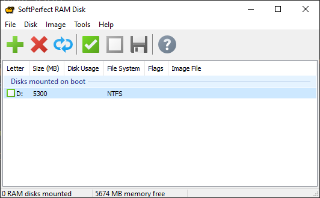

# High speed camera project

## Useful links

#### 1. [User Manual MV2-D1280-640 CMOS Area Scan Camera](https://www.manualslib.com/manual/802815/Photon-Focus-Mv2-D1280-640.html)
   

#### 2. [MATROX Configuration files for MV2-D1280-640-CL-8](https://ftp.matrox.com/pub/imaging/odyssey/dcfs/photonfocus/MV2-D1280-640-CL-8/)

#### 3. [Matrox Solios eCL/XCL Camera Interface Application Note](https://ftp.matrox.com/pub/imaging/SoliosXCL/appnotes/Photonfocus/SoliosXCL_MVD1280640CL8.pdf)

#### 4. [Matrox Radient eV-CL frame grabber](https://www.matrox.com/en/imaging/products/components/frame-grabbers/radient-ev-cl)

#### 5. [PFRemote software download](https://www.photonfocus.com/support/software/) - Required file is PFInstaller Win64, you need to fill out a form to download.

#### 6. [MIL Lite-X frame grabber driver and library download](https://prod.matrox.com/en/imaging/apps/mil-lite)

This is the main driver package required to use the Matrox framegrabber. It comes with the MIL libraries for C++ and Python. You need to fill out a form to download it, but it is free.

#### 7. [SoftPerfect RAM Disk](https://www.softperfect.com/products/ramdisk/)

This is possibly not needed on new fast PCs with NVMe SSDs (that's a lot of acronyms), but due to the limitations of the drive in the lab computer (max write speed <500 MB/s), I had to use a RAM disk to ensure the frame grabber is not bottlenecked by the slow hardware. When only using the SATA SSD, it was constantly missing frames at higher framerates.

## Required software and libraries

1. Python
2. Matrox Imaging Library (Python bindings are installed automatically)
3. SoftPerfect RAM Disk


## How to set up your environment for this project

1. Clone the repository from github - type the following command in terminal

        git clone https://github.com/jakub-sekula/graphene

2. Open terminal inside the downloaded folder and create a new virtual environment by running:

        python -m venv venv

3. Activate the virtual environment

        ./venv/Scripts/activate

4. Install the required modules

        pip install -r ./requirements.txt

5. Make sure that the RAM disk is mounted as drive D. If it is not, open the start menu and run the program

        SoftPerfect RAM Disk

When it launches, click the green checkmark to mount the RAM disk.



With those steps done, you are ready to run the camera grabber program.

## List of scripts included

To run the scripts, you should first change the working directory to the src folder by typing:

    cd src

### 1. sequence_export.py
This is a script to grab video from the camera and save it to the output folder. To run it, make sure the camera is connected and ready and run

    python sequence_export.py

After this, a window a live camera view will appear. You can use this to adjust camera settings and framing, as no video is being saved yet.

You will see the following text in the terminal right after launching:
        
```
SEQUENCE ACQUISITION SCRIPT
-----------------------------

Using configuration file from:
workingpath\graphene\configs\[WORKING CONFIG] MV2-D1280-640-CL-8_1280x1024_8Taps8bitCon.dcf

Enter recording time (maximum 8.50 seconds) and start capture:
```

By default, output files are saved to the following directories:

Videos:

    ./videos/*.avi

Images (one frame is saved at the beginning, don't really need this but it doesn't hurt either):

    ./images/*.jpg

To capture an image, enter the desired recording length and press Enter. The capture will begin and you will see the following output in the terminal:

```
Enter recording time (maximum 8.50 seconds) and start capture: 5
Saving sequence to file VideoCapture_16-45-28_23-Feb-2022.avi

Press Enter to stop capture
Time limit of 5.00 seconds reached, saving file
2452 frames saved (0 missed), at 487.76 fps


Moving file "VideoCapture_16-45-28_23-Feb-2022.avi" (3065MB) from D:\ to C:\Users\UVis\Desktop\graphene\videos...
Move completed in 7.55s at average speed of 405.98 MB/s

Image file saved to workingpath\graphene\images\ImageCapture_16-45-28_23-Feb-2022.png
Video file saved to workingpath\graphene\videos\VideoCapture_16-45-28_23-Feb-2022.avi
```

Take note of the following line and verify that no frames were missed and that the framerate is what you expect.

    2452 frames saved (0 missed), at 487.76 fps

You can now view the saved raw files in the output folders specified above.

## 2. video_to_frames.py

This script converts the output video in .avi format to individual frames in .jpg format. It is currently still a bit clunky and some paths are hardcoded, but it works good enough for what it needs to do. 

Before running the script make sure its output folder is empty:

    workingpath/tests/images

If it's not, delete everything from it before running.

To start the converion enter:

    python ./video_to_frames.py

It will ask you to enter a filename of the video file to convert. You should include the entire filename with the .avi extension (starting with VideoCapture...)

When you press Enter, the program will convert the video. You will see the following output:

```
Enter filename: VideoCapture_16-45-28_23-Feb-2022.avi
Read a new frame:  0 True
Read a new frame:  10 True
Read a new frame:  20 True
Read a new frame:  30 True
Read a new frame:  40 True
Read a new frame:  50 True
Read a new frame:  60 True
Read a new frame:  70 True
Read a new frame:  80 True
...
```

Once it's done, the files frames will be in the output folder which is located at

    workingpath/tests/images

## frames_to_video.py

This is mostly just for fun and for visualisation of the flow in slow motion - it takes the frames extracted using video_to_frames.py and renders them into a new video file at 30 fps.

To use it, run:

    python frames_to_video.py

Enter the output filename (without extension) and press enter to start the conversion. Ignore the warning message that appears:

```
OpenCV: FFMPEG: tag 0x5634504d/'MP4V' is not supported with codec id 12 and format 'mp4 / MP4 (MPEG-4 Part 14)'
OpenCV: FFMPEG: fallback to use tag 0x7634706d/'mp4v'
```

The slow motion video will be saved to the following path:

    workingpath/graphene/tests/outputs/filename.mp4